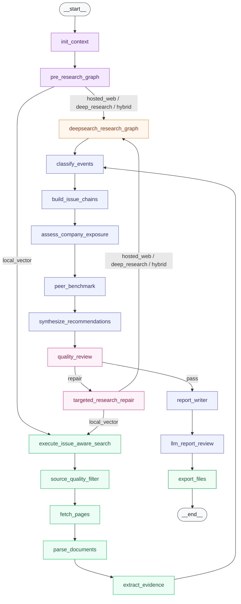

<div align="center">
  <h1>ESG Monthly Agent</h1>
</div>

<div align="center">
  <h3>Evidence-backed ESG monthly report workflow built with LangGraph.</h3>
</div>

<div align="center">
  
  
  
  
</div>

<br>

This repository contains a workflow for preparing evidence-backed ESG monthly report working papers and Markdown report outputs. It uses LangGraph to coordinate research planning, evidence extraction, issue-chain construction, quality checks, and file export.

The default example is configured around China Shenhua. The command-line interface also accepts another company name, tickers, benchmark companies, and reporting period.

```bash
pip install -r requirements-dev.txt
LANGSMITH_TRACING=false pytest -q
```

```bash
python main.py --company 中国神华 --period 2026-06 \
  --tickers 601088.SH 01088.HK \
  --peers 中煤能源 陕西煤业 兖矿能源 华能国际 华电国际
```

> [!NOTE]
> Generated reports are reviewable working documents. They should be checked against company data, source documents, and applicable disclosure requirements before use.

## Why use this project?

The project is organized around traceable report preparation rather than free-form generation:

- **Evidence records**: factual items are stored as `EvidenceItem` objects with source metadata and evidence ids.
- **Typed state**: each step reads and writes Pydantic-backed structures instead of passing only prose.
- **Separated research modes**: local/manual sources are handled separately from hosted web-search providers.
- **Intermediate artifacts**: search tasks, provider results, events, issue chains, recommendations, and quality checks are exported as JSON.
- **Regression tests**: tests cover schema validation, graph execution checks, provider preflight, citation extraction, report de-duplication, and quality checks.

## Workflow

```text
company / period / tickers / benchmark companies
        ↓
report contract
        ↓
company boundary and material issue planning
        ↓
evidence needs
        ↓
local sources or hosted web-search providers
        ↓
evidence items
        ↓
event classification
        ↓
issue chains
        ↓
company exposure assessment
        ↓
benchmark-company action checks
        ↓
recommendations
        ↓
quality review
        ↓
Markdown report and JSON artifacts
```

In hosted mode, the workflow expects providers to return source URLs or citations that can be mapped back to evidence. P2/P3 media or generic search results can be retained as leads, but they are not sufficient by themselves for key factual claims.

## LangGraph nodes

This Mermaid graph mirrors the current `graph.py` node layout and renders directly on GitHub. The same node names appear in LangGraph Studio and LangSmith traces.



The local branch runs source filtering, fetch, parsing, and evidence extraction. The hosted branch skips direct page fetching and uses provider-returned citations before entering the same event and reasoning path.

## Installation

Use Python 3.11.

```bash
cd /path/to/ESG-agent/esg_monthly_agent
python -m venv .venv
source .venv/bin/activate
pip install -r requirements-dev.txt
```

Editable install is also supported:

```bash
pip install -e ".[dev]"
```

## Configuration

Copy the environment template:

```bash
cp .env.example .env
```

For local verification runs, the default settings can use local or seeded evidence. For hosted web research, disable local fallback and configure at least one provider key:

```bash
ESG_USE_LOCAL_SOURCES=false
ESG_USE_SEED_EVIDENCE=false
ESG_RESEARCH_MODE=hosted_web
ESG_DEFAULT_RESEARCH_PROVIDER=tavily_official_search
TAVILY_API_KEY=your_tavily_key
```

Supported hosted providers:

| Provider | Key | Purpose |
|---|---|---|
| `tavily_official_search` | `TAVILY_API_KEY` | Official-domain constrained search through Tavily |
| `zhipu_web_search` | `ZHIPU_API_KEY` or `BIGMODEL_API_KEY` | Zhipu Web Search API |
| `qwen_dashscope_search` | `DASHSCOPE_API_KEY` or `QWEN_DASHSCOPE_API_KEY` | DashScope search-enabled generation |
| `openai_web_search` | `OPENAI_API_KEY` | OpenAI hosted web search |
| `anthropic_web_search` | `ANTHROPIC_API_KEY` | Anthropic server-side web search |

LangSmith tracing is optional:

```bash
LANGSMITH_TRACING=true
LANGSMITH_ENDPOINT=https://api.smith.langchain.com
LANGSMITH_PROJECT=ESG-month-report
LANGSMITH_API_KEY=your_langsmith_key
```

Set `LANGSMITH_TRACING=false` for local test runs when no LangSmith key is configured.

## Usage

Local/default run:

```bash
python main.py --company 中国神华 --period 2026-06 \
  --tickers 601088.SH 01088.HK \
  --peers 中煤能源 陕西煤业 兖矿能源 华能国际 华电国际
```

Hosted web run with Tavily:

```bash
ESG_USE_LOCAL_SOURCES=false \
ESG_USE_SEED_EVIDENCE=false \
python main.py \
  --company 中国神华 \
  --period 2026-06 \
  --research-mode hosted_web \
  --research-provider tavily_official_search \
  --max-research-rounds 2 \
  --max-search-calls 2
```

Run the first hosted research round against every configured provider:

```bash
python main.py \
  --company 中国神华 \
  --period 2026-06 \
  --research-mode hosted_web \
  --call-all-available-providers
```

Optional LLM review writes a separate `llm_review.json` file and does not overwrite the report:

```bash
export ESG_LLM_API_KEY=your_llm_key
python main.py --company 中国神华 --period 2026-06 \
  --use-llm \
  --llm-provider deepseek \
  --llm-model deepseek-v4-pro \
  --llm-base-url https://api.deepseek.com
```

Chat-only gateways are used only for review unless their responses include source URLs that can be mapped into evidence.

## Outputs

Run artifacts are written under:

```text
runs/{period}_{company}/
```

Common files:

| File | Description |
|---|---|
| `reports/esg_monthly_report.md` | Draft monthly report |
| `reports/report_final.md` | Final markdown export for the run |
| `evidence_items.json` | Evidence records |
| `source_records.json` | Source metadata |
| `deepsearch_tasks.json` | Hosted research tasks |
| `deepsearch_results.json` | Provider results and citations |
| `deepsearch_decisions.json` | Reflection and retry decisions |
| `rule_changes.json` | Policy, rating, and standard updates |
| `industry_events.json` | Industry events |
| `company_events.json` | Company events |
| `peer_actions.json` | Benchmark-company actions; field name follows the internal schema |
| `issue_chains.json` | Issue-level evidence chains |
| `company_exposures.json` | Company exposure assessments |
| `recommendations.json` | Recommendation records |
| `quality_checks.json` | Quality review result |

Generated run directories are ignored by git. Keep only `runs/.gitkeep` in the repository.

## Repository layout

```text
.
├── main.py                         # CLI entry point
├── app.py                          # LangGraph-compatible graph export
├── graph.py                        # Main graph composition
├── state.py                        # Shared graph state
├── config.py                       # Environment and defaults
├── agents/                         # Planning and repair helpers
├── nodes/                          # LangGraph node functions
├── subgraphs/                      # Reusable graph fragments
├── skills/                         # Skill contracts, runners, schemas
├── schemas/                        # Pydantic models
├── research_providers/             # Hosted and local provider adapters
├── tools/                          # Local source, parser, store, and review tools
├── prompts/                        # Prompt templates
├── tests/                          # Regression tests
├── docs/                           # Runbook and file inventory
├── runs/                           # Generated outputs; ignored except .gitkeep
└── storage/                        # Local storage placeholders
```

See also:

- `docs/RUNBOOK.md`
- `docs/PROJECT_STRUCTURE.md`
- `docs/FILE_INVENTORY.md`

## Tests

```bash
LANGSMITH_TRACING=false pytest -q
```

The current test suite contains 48 tests.

## Operational scope

- This repository focuses on report preparation: research planning, evidence capture, issue-chain construction, quality review, and Markdown/JSON export.
- Deployment packaging, role and permission controls, audit-log retention, release policy, rollback procedure, and human approval workflow are outside the current repository scope.
- The default material topics and benchmark companies are tuned for the China Shenhua example and should be reviewed before using another company.
- Hosted research quality depends on provider coverage, query wording, source availability, and date filtering.
- Local seeded evidence is intended for deterministic local verification and should not be used as final report evidence.
- `.env`, API keys, generated `runs/` outputs, local databases, and cache files should not be committed.
- Add or confirm a license before redistribution.

## Acknowledgements

This project uses [LangGraph](https://www.langchain.com/langgraph) for graph orchestration and [LangChain](https://www.langchain.com/) ecosystem packages for optional documentation tooling.
